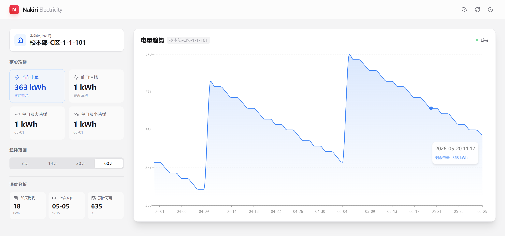

# Nakiri Electricity (GitHub Pages Version)

[](https://github.com/Dainsleif233/NakiriElectricity/actions/workflows/daily_check.yml)
[](https://opensource.org/licenses/MIT)

这是一个基于 **React** 和 **GitHub Actions** 的无服务器电量监测系统。
特点：**零成本**、**无需服务器**、**自动爬虫**、**美观图表**。



## ✨ 功能特性

- 📊 **深度数据分析**：实时电量、昨日消耗、单日最大/最小消耗。
- 📈 **交互式图表**：支持平滑曲线、数据点交互、多时间维度（7天/14天/30天/60天）。
- 🎨 **现代化 UI**：基于 Tailwind CSS，完美适配移动端，支持深色模式 (Dark Mode)。
- 🤖 **全自动运行**：利用 GitHub Actions 自动抓取数据，无需人工干预。
- ⚡ **智能预测**：基于历史数据估算剩余可用天数，检测充值记录。
- 🔔 **低电量提醒**：当最新电量低于阈值且本次有新提交时，自动给该 commit 添加提醒评论。

## 🚀 快速部署 (Fork & Run)

你不需要任何服务器，只需要一个 GitHub 账号。

### 1. Fork 本仓库
点击右上角的 **Fork** 按钮，将本项目复制到你的 GitHub 账号下。

### 2. 配置环境变量 (Secrets)
进入你 Fork 后的仓库，点击 `Settings` -> `Secrets and variables` -> `Actions` -> `New repository secret`。

添加以下 6 个 Secret（必须大写）：

| Secret Name | 说明 | 示例 |
|Data | Description | Example |
|---|---|---|
| `TOKEN` | 令牌 | `eyXXX` |
| `CAMPUS` | 校区 | `校本部` |
| `BUILDING` | 区域 | `C区` |
| `FLOOR` | 楼栋 | `1` |
| `ROOM` | 房间 | `1-1-101` |
| `THRESHOLD` | 低电量提醒阈值，可选，默认 `30` | `30` |

**房间信息需要和小程序中的房间信息一致。**
如果未配置 `THRESHOLD`，工作流会默认在电量低于 `30` 时触发提醒评论。

#### 令牌获取方式：

- 打开 [综合门户](http://ehall.ujs.edu.cn/) 登入账号。
- 搜索打开 `一卡通服务`，右上角打开用户设置。
- 此时 URL 中 `synjones-auth` 值就是需要的令牌，注意不要泄露。

### 3. 启用 GitHub Actions
进入 `Actions` 标签页，点击 `I understand my workflows, go ahead and enable them`。
然后点击左侧的 `Daily Electricity Check`，点击 `Run workflow` 手动触发一次，确保配置正确。

### 4. 开启 GitHub Pages
进入 `Settings` -> `Pages`。
- **Source**: 选择 `GitHub Actions`

等待几分钟，你的专属电量监控页面就上线了！🎉

## 🛠️ 本地开发

如果你想修改代码或贡献功能：

1. **克隆仓库**
   ```bash
   git clone https://github.com/Dainsleif233/NakiriElectricity.git
   cd NakiriElectricity
   ```

2. **安装依赖**
   ```bash
   npm install
   ```

3. **配置环境变量**
   在根目录创建 `.env` 文件（参考 `.env.example`），填入你的测试房间信息。

4. **启动开发服务器**
   ```bash
   npm run dev
   ```

## ❓ 常见问题 (FAQ)

**Q: 数据多久更新一次？**
A: 默认每3小时更新一次（GitHub Actions 定时任务）。你也可以在 Actions 页面手动触发更新。

**Q: 为什么图表显示“暂无数据”？**
A: 刚部署时没有历史数据。请等待 Actions 运行几次，或者手动触发几次以积累数据。

**Q: 部署失败怎么办？**
A: 检查 Actions 日志，通常是环境变量配置错误。

**Q: 低电量提醒什么时候会触发？**
A: 当 `public/data.json` 中最新一条历史记录的电量小于 `THRESHOLD` 时，工作流会自动给新的 commit 添加评论提醒。

## 📄 许可证

本项目 Fork 自 [Polaris-Leo/Nakiri-Electricity-Github](https://github.com/Polaris-Leo/Nakiri-Electricity-Github)。

采用 [MIT 许可证](LICENSE)。

---
*注意：本项目仅供学习交流使用，请勿用于商业用途或恶意爬取。*
